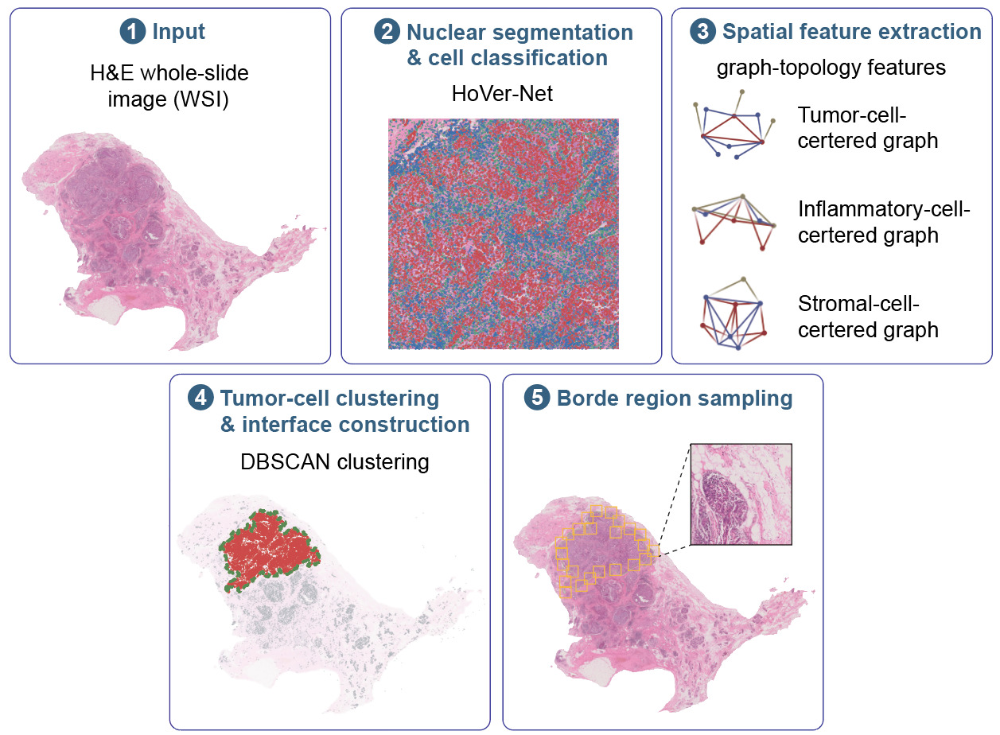
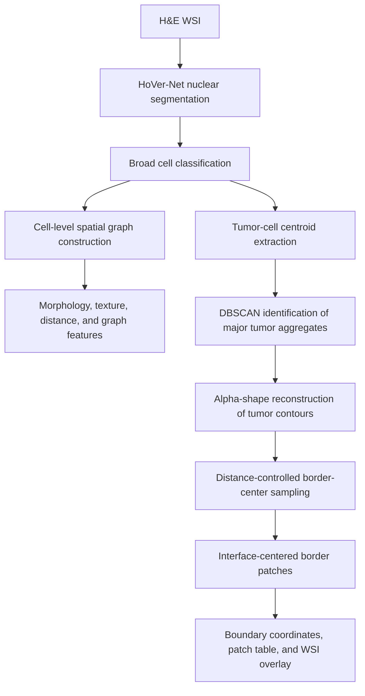

# TNBC Invasive-Border Ecosystem (TIBE)

TIBE is a Python workflow for nuclear segmentation, cell-level spatial graph
construction, topology-feature extraction, and computational identification of
invasive tumor borders in triple-negative breast cancer (TNBC) whole-slide
images (WSIs).

The current repository supports three reproducible stages:

1. HoVer-Net–based nuclear segmentation and broad cell classification.
2. Cell-level spatial graph construction and feature extraction.
3. DBSCAN- and alpha-shape–based identification of the tumor–non-tumor
   interface and generation of standardized border patches.


---

## Workflow




The graph stage uses the following broad HoVer-Net classes:

- `T`: neoplastic/tumor cells (`CellType == 1`)
- `I`: inflammatory cells (`CellType == 2`)
- `S`: connective/stromal cells (`CellType == 3`)
- `N`: other non-neoplastic/normal cells (`CellType == 5`)

---


## Environment

The supplied environment targets Python 3.9 and PyTorch with CUDA 12.1. This
configuration matches the A100 GPUs and NVIDIA 535 driver on the target node.

From the directory containing `TIBE/`:

```bash
conda env create -f TIBE/environment.yml
conda activate tnbc-border-py39
```

Alternatively, from inside `TIBE/`:

```bash
python -m pip install -r requirements.txt
```

OpenSlide requires both the `openslide-python` package and a working native
OpenSlide library. The supplied Conda environment installs the native library
through `conda-forge`.

---

## Input Resolution

The workflow does not require that every WSI be scanned at exactly 40×.
However, the default parameters used in the manuscript were established for
WSIs scanned at approximately 40× with a level-0 resolution of
0.25 µm/pixel.

For slides acquired at another magnification or physical resolution, either:

1. resample the image and cell coordinates to the reference resolution; or
2. convert all pixel-based distance and patch-size parameters so that the same
   physical scales are preserved.

The physical pixel size or native magnification must therefore be known for
each WSI.

---

## Stage 1: Nuclear Segmentation

Run commands from the `TIBE/` directory.

`F1_CellSegment.py` processes the WSIs contained in one input directory:

```bash
python src/F1_CellSegment.py \
  --input-dir example/input_example \
  --output-dir example/hovernet_output
```

The fixed inference settings used in the manuscript are:

| Setting | Value |
|---|---:|
| GPU visibility | GPU `0` |
| Model | PanNuke-pretrained HoVer-Net |
| Model mode | `fast` |
| Nuclear classes | `6` |
| Processing magnification | `40×` |
| Input/output patch size | `256 / 164` pixels |
| Tile/chunk size | `2048 / 10000` pixels |
| Ambiguous margin | `128` pixels |
| Batch size | `16 × detected GPU count` |
| Inference workers | `8` |

The model files are resolved relative to the repository:

```text
Hover/hovernet_fast_pannuke_type_tf2pytorch.tar
Hover/type_info.json
```

`F1_Code.py` is the batch wrapper. It expects an input root whose immediate
subdirectories each represent one case:

```bash
python src/F1_Code.py \
  --input-root path/to/case_directories \
  --output-dir path/to/hovernet_output
```

Typical HoVer-Net outputs include nucleus-level JSON files, masks, and
thumbnail images.

---

## Stage 2: Spatial Graph and Feature Extraction

`F3_FeatureExtract.py` reads a HoVer-Net nucleus JSON file and its source WSI,
constructs cell-level spatial graphs, and writes cell and edge tables:

```bash
python src/F3_FeatureExtract.py \
  --json-path example/hovernet_output/json/example001.json \
  --wsi-path example/input_example/example001.ndpi \
  --output-dir example/features
```

`F3_code.py` is a compatibility entry point with the same command-line
arguments:

```bash
python src/F3_code.py \
  --json-path example/hovernet_output/json/example001.json \
  --wsi-path example/input_example/example001.ndpi \
  --output-dir example/features
```

### Spatial graph construction

Each detected cell is represented as a graph node using its centroid coordinate
and broad cell-type label. Separate homotypic and heterotypic graphs are
constructed for:

- tumor–tumor;
- inflammatory–inflammatory;
- stroma–stroma;
- tumor–inflammatory;
- tumor–stroma; and
- inflammatory–stroma relationships.

The graph parameters used in the manuscript are:

| Setting | Value |
|---|---:|
| Maximum interaction distance | `100` level-0 pixels |
| Maximum nearest neighbours | `5` |
| WSI feature level | `0` |

For a level-0 resolution of 0.25 µm/pixel, 100 pixels correspond to
approximately 25 µm.

### Extracted features

The output tables contain, where applicable:

- nuclear morphology features;
- GLCM texture features;
- minimum and mean edge length;
- connected-component size;
- degree;
- coreness;
- local clustering coefficient;
- eccentricity;
- harmonic centrality;
- closeness;
- betweenness; and
- normalized betweenness.

Inflammatory cells additionally receive the stroma-blocker measurement
implemented in `WSIGraph.py`.

### Output structure

```text
<output-dir>/<sample>/
├── <sample>_Feats_T.csv
├── <sample>_Feats_I.csv
├── <sample>_Feats_S.csv
├── <sample>_Feats_N.csv
└── <sample>_Edges.csv
```

The tumor-cell table (`*_Feats_T.csv`) is the required cell-coordinate input
for Stage 3.

---

## Stage 3: Invasive-Border Identification

`src/image_boundary_get.py` identifies major tumor-cell aggregates,
reconstructs their outer contours, and generates standardized
interface-centered border patches.

### Required inputs

1. A tumor-cell CSV file containing a `Centroid` column in level-0 coordinates.
2. A downsampled analysis image aligned with the transformed coordinates.
3. A sample identifier.
4. An output directory.

The analysis image does not have to be the fourth pyramid level specifically.
The `--downsample-factor` argument must match the coordinate scale of the
analysis image.

### Example command

```bash
python src/image_boundary_get.py \
  --tumor-csv /home/ma-user/sfs3/zhangh/FUSCC_analysis/TIBE/example/features/example001/example001_Feats_T.csv \
  --wsi-path example/input_example/example001.ndpi \
  --output-dir example/border_output/example001 \
  --sample-name example001 \
  --analysis-level 4 \
  --dbscan-eps 20 \
  --dbscan-min-samples 10 \
  --min-cluster-cells 20000 \
  --minimum-center-spacing 250 \
  --patch-size 250 \
  --save-patches
```

### Computational steps

#### 1. Coordinate transformation

Tumor-cell centroid coordinates are divided by the configured downsampling
factor and mapped to the analysis-image coordinate system.

Under the default manuscript configuration:

```text
Level-0 resolution:        0.25 µm/pixel
Downsampling factor:       16
Analysis-image resolution: 4 µm/pixel
```

#### 2. Tumor-cell clustering

DBSCAN is applied to the transformed tumor-cell centroids.

| Setting | Default value |
|---|---:|
| `eps` | `20` analysis-image pixels |
| `min_samples` | `10` |
| Retained cluster size | strictly greater than `20,000` tumor cells |

Under the default 4 µm/pixel analysis scale, an `eps` of 20 pixels corresponds
to approximately 80 µm.

#### 3. Tumor-contour reconstruction

For each retained tumor-cell aggregate:

1. duplicate coordinates are removed;
2. an alpha-shape model is fitted to the aggregate;
3. the alpha value is optimized for that aggregate; and
4. the exterior boundary of the reconstructed non-convex polygon is extracted.

The resulting contour is operationally defined as the tumor–non-tumor
interface.

#### 4. Border-center sampling

Candidate contour points are processed sequentially. A point is retained only
when its Euclidean distance from every previously selected center is at least
the configured minimum spacing.

#### 5. Border-patch generation

A square patch is centered on each retained contour point.

| Setting | Default value |
|---|---:|
| Minimum center spacing | `250` analysis-image pixels |
| Patch side length | `250` analysis-image pixels |

Under the default manuscript configuration, both values correspond to
approximately 1 mm. Each patch is centered on the reconstructed interface and
therefore samples both the tumor side and the immediately adjacent non-tumor
side.

Patches extending beyond the analysis image are retained in the coordinate
table and marked with `fully_inside_image = False`. Only patches located
entirely within the image are exported when `--save-patches` is used.

### Stage 3 outputs

```text
<output-dir>/
├── <sample>_dbscan_cluster_summary.csv
├── <sample>_boundary_points.csv
├── <sample>_border_patches.csv
├── <sample>_border_overlay.png
├── <sample>_run_parameters.json
└── <sample>_patches/
```

#### `<sample>_dbscan_cluster_summary.csv`

Contains the DBSCAN cluster label, tumor-cell count, and retention status.

#### `<sample>_boundary_points.csv`

Contains the reconstructed contour coordinates for each retained tumor
aggregate.

#### `<sample>_border_patches.csv`

Contains:

- patch identifier;
- patch-center coordinates;
- bounding-box coordinates; and
- whether the complete patch lies within the analysis image.

#### `<sample>_border_overlay.png`

Displays the reconstructed tumor contours and sampled border patches on the
analysis image.

#### `<sample>_run_parameters.json`

Records the input files, numerical parameters, retained-cluster count, and
generated-patch count for the run.

---

## Example Data

The repository includes one de-identified example WSI:

```text
example/input_example/example001.ndpi
```

Recommended example materials include:

```text
example/
├── input_example/
│   └── example001.ndpi
├── hovernet_output/
│   └── json/example001.json
├── tumor_centroids/
│   └── example001_Feats_T.csv
├── level4_images/
│   └── example001_level4.png
└── expected_output/
    └── example001/
```

The example should allow users to start either from the WSI or directly from
the tumor-cell centroid table.

---

## Reproducibility

For manuscript reproduction, record at minimum:

- the exact Conda/Python environment;
- GPU, CUDA, and cuDNN versions;
- WSI native magnification and physical pixel size;
- image level or downsampling factor used for border identification;
- all graph, DBSCAN, contour, spacing, and patch parameters;
- the HoVer-Net weight and cell-type configuration checksums; and
- any deviations from the default configuration.

The Stage 3 script writes its numerical settings to
`<sample>_run_parameters.json`.

---

## Quality Control

Inspect the following outputs before downstream analysis:

1. nuclear segmentation and broad cell-type overlays;
2. tumor, inflammatory, and stromal centroid distributions;
3. DBSCAN tumor-cluster maps or summaries;
4. alpha-shape contour overlays;
5. final border-patch overlays; and
6. patches affected by tissue folds, blur, pen marks, necrosis, debris, or
   insufficient tissue.

A reconstructed contour should correspond to a recognizable invasive
tumor–host interface on the H&E image. Any manually excluded region or
parameter deviation should be recorded.

---


## Citation and Data Availability

When distributing this workflow, provide only appropriately de-identified data
and add:

- the final manuscript citation;
- the repository license;
- the software release version;
- the archived Zenodo DOI or equivalent persistent identifier; and
- access conditions for any restricted clinical data.

Suggested manuscript citation:

```text
Zhang H, Yang F, Tian P, et al. Spatial border ecosystems reveal prognosis and vulnerabilities in triple-negative breast cancer.
[Journal information to be updated]
```
